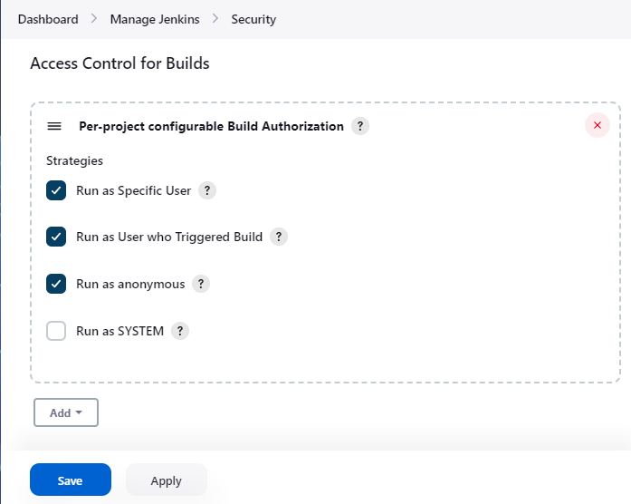
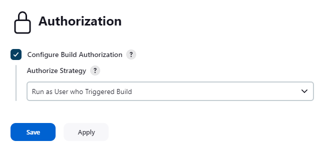

[[authorize-project-plugin]]
= Authorize Project Plugin
:toc:
:toc-placement!:
ifdef::env-github[]
:tip-caption: :bulb:
:note-caption: :information_source:
:important-caption: :heavy_exclamation_mark:
:caution-caption: :fire:
:warning-caption: :warning:
endif::[]

link:https://ci.jenkins.io/job/Plugins/job/authorize-project-plugin/job/master/[image:https://ci.jenkins.io/job/Plugins/job/authorize-project-plugin/job/master/badge/icon[Build]]
link:https://github.com/jenkinsci/authorize-project-plugin/graphs/contributors[image:https://img.shields.io/github/contributors/jenkinsci/authorize-project-plugin.svg?color=blue[Contributors]]
link:https://plugins.jenkins.io/authorize-project/[image:https://img.shields.io/jenkins/plugin/i/authorize-project.svg?color=blue&label=installations[Jenkins Plugin Installs]]
link:https://plugins.jenkins.io/authorize-project/[image:https://img.shields.io/jenkins/plugin/v/authorize-project.svg[Plugin]]

toc::[]

https://jenkins.io[Jenkins] plugin to configure a project to run with specified authorization.

== What's this?

This plugin provides following features:

* Projects can be configured to have their builds run with specified authorization.
 ** This is an implementation for https://javadoc.jenkins-ci.org/jenkins/security/QueueItemAuthenticator.html[`QueueItemAuthenticator`].
* The following ways are provided to specify authorization.
 ** Run as the user who triggered the build.
  *** Does not work for scheduled, or polled builds.
 ** Run as anonymous.
 ** Run as the specified user.
  *** You are requested to enter the password of the specified user except for the following cases:
   **** You are an administrator.
   **** You are the specified user.
   **** The specified user is not changed from the last configuration, and "No need for re-authentication" is checked.
    ***** This can threaten your Jenkins security. Be careful to use.
* Provides an extension point to add new ways to specify authorization.

== Extension point

A new way to authorize projects can be added by extending `org.jenkinsci.plugins.authorizeproject.AuthorizeProjectStrategy`, overriding the following method:

----
public abstract Authentication authenticate(hudson.model.AbstractProject<?, ?> project, hudson.model.Queue.Item item);
----

== Screenshots

* After installed Authorize Project plugin, you will find "Access
Control for Builds" in "Manage Jenkins" > "Configure Global
Security". Adding "Configure Build Authorizations in Project
Configuration" enables Authorize Project plugin. +

 ** You can also disable specific strategies in this page. Disabled
strategies are never used for authorization.
* A new side bar menu "Authorization" will appear in project pages. +
image:docs/images/sidebar.png[]
* You can select how to authorize builds of the project in the
"Authorization" page. +

* When selecting "Run as Specific User", you can enter User ID with
whose authorization builds will run. If you enter a user ID except
yourself and have no administrative privilege, you are required to
enter the password of that user. +
image:docs/images/authorization-page-specific-user.png[]
 ** You can also use API token, especially for non password-based
security realms.
* Configuring project settings by unauthorized users are forbidden
when you configure the authorization for the project. See https://wiki.jenkins.io/display/JENKINS/Authorize+Project+plugin#AuthorizeProjectplugin-What%27sthis?[#What's
this?]
for details. +
image:docs/images/access-denied.png[]

== Issues

To report a bug or request an enhancement to this plugin please create a
ticket in JIRA (you need to login or to sign up for an account). Also
have a look on https://wiki.jenkins.io/display/JENKINS/How+to+report+an+issue[How to report an
issue]

* https://issues.jenkins-ci.org/secure/CreateIssueDetails!init.jspa?pid=10172&issuetype=1&components=18155&priority=4&assignee=ikedam[Bug
report]
* https://issues.jenkins-ci.org/secure/CreateIssueDetails!init.jspa?pid=10172&issuetype=4&components=18155&priority=4[Request or propose an improvement of existing
feature]
* https://issues.jenkins-ci.org/secure/CreateIssueDetails!init.jspa?pid=10172&issuetype=2&components=18155&priority=4[Request or propose a new
feature]
