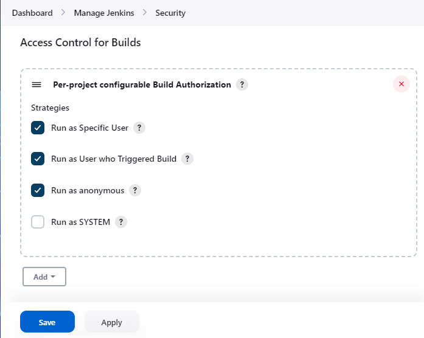
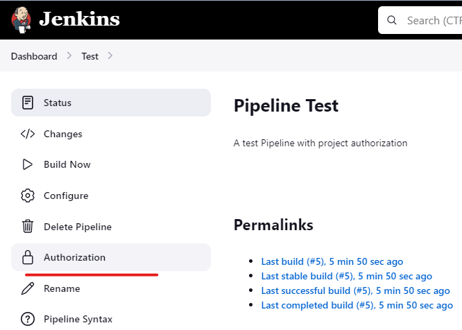
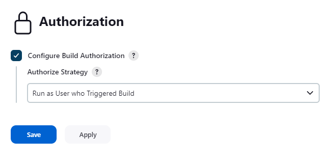
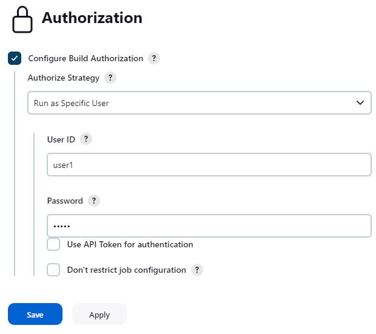
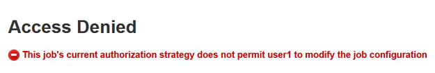

# Autorize Project Plugin for Jenkins

[](https://plugins.jenkins.io/authorize-project)
[](https://github.com/jenkinsci/authorize-project-plugin/releases/latest)
[](https://plugins.jenkins.io/authorize-project)

This plugin allows configuring projects to run with specified authorization.

## What's this?

This plugin provides following features:

-   You can configure projects to have their builds run with specified
    authorization.
    -   This is an implementation for
        [QueueItemAuthenticator](http://javadoc.jenkins-ci.org/jenkins/security/QueueItemAuthenticator.html).
-   Provides following ways to specify authorization.
    -   Run as the user who triggered the build.
        -   Does not work for scheduled, or polled builds.
        -   Configuring projects are allowed only to users with the
            BUILD permission.
    -   Run as anonymous.
    -   Run as the specified user.
        -   You are requested to enter the password of the specified
            user except following cases:
            -   You are an administrator.
            -   You are the specified user.
            -   The specified user is not changed from the last
                configuration, and "No need for re-authentication" is
                checked.
                -   This can threaten your Jenkins security. Be careful
                    to use.
        -   Configuring projects are allowed only to administrators and
            the user configured as the authorization.
            -   "Don't restrict job configuration" allows other users
                (with the CONFIGURE permission) to configure the
                project. Ensure that only appropriate users have
                CONFIGURE permission for that project.
    -   Run as SYSTEM
        -   This is provided only to cancel the global configuration.
            SYSTEM authorization is often considered as "unconfigured",
            features provided by plugins may treat it as anonymous.
-   Provides an extension point to add new ways to specify
    authorization.

## Screenshots

-   After installed Authorize Project plugin, you will find "Access
    Control for Builds" in "Manage Jenkins" \> "Configure Global
    Security". Adding "Configure Build Authorizations in Project
    Configuration" enables Authorize Project plugin.  
    
    -   You can also disable specific strategies in this page. Disabled
        strategies are never used for authorization.
-   A new side bar menu "Authorization" will appear in project pages.  
    
-   You can select how to authorize builds of the project in the
    "Authorization" page.  
    
-   When selecting "Run as Specific User", you can enter User ID with
    whose authorization builds will run. If you enter a user ID except
    yourself and have no administrative privilege, you are required to
    enter the password of that user.  
    
    -   You can also use API token, especially for non password-based
        security realms.
-   Configuring project settings by unauthorized users are forbidden
    when you configure the authorization for the project. See [\#What's
    this?](https://wiki.jenkins.io/display/JENKINS/Authorize+Project+plugin#AuthorizeProjectplugin-What%27sthis?)
    for details.  
    

## Extension point

A new way to authorize projects can be added with extending
`org.jenkinsci.plugins.authorizeproject.AuthorizeProjectStrategy`,
overriding the following method:

``` syntaxhighlighter-pre
public abstract Authentication authenticate(hudson.model.AbstractProject<?, ?> project, hudson.model.Queue.Item item);
```

Use `AuthorizeProjectStrategyDescriptor` for `Descriptor`.  
If you want to provide global configuration properties, do as following:

-   `global-security.jelly` is displayed in "Configure Global Security"
    page.
-   Override
    `AuthorizeProjectStrategyDescriptor#configureFromGlobalSecurity` to
    save configuration.

## Issues

To report a bug or request an enhancement to this plugin please create a
ticket in JIRA (you need to login or to sign up for an account).
Also have a look on [How to report an issue](https://www.jenkins.io/participate/report-issue/)

-   [Bug report](https://issues.jenkins.io/secure/CreateIssueDetails!init.jspa?pid=10172&issuetype=1&components=18155&priority=4&assignee=ikedam)
-   [Request or propose an improvement of existing feature](https://issues.jenkins.io/secure/CreateIssueDetails!init.jspa?pid=10172&issuetype=4&components=18155&priority=4)
-   [Request or propose a new feature](https://issues.jenkins.io/secure/CreateIssueDetails!init.jspa?pid=10172&issuetype=2&components=18155&priority=4)

## Change Log

* See [GitHub Releases]() for the recent releases
* See the [Changelog Archive](./docs/CHANGELOG.old.md) for version 1.3.0 and older
