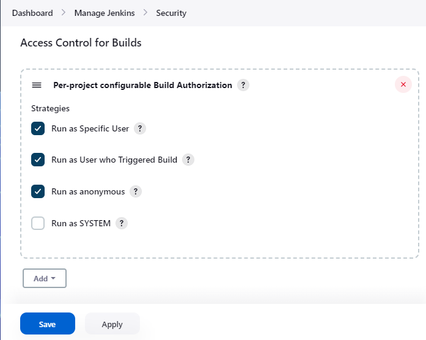
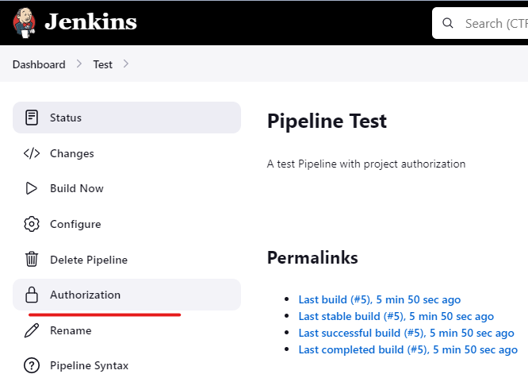
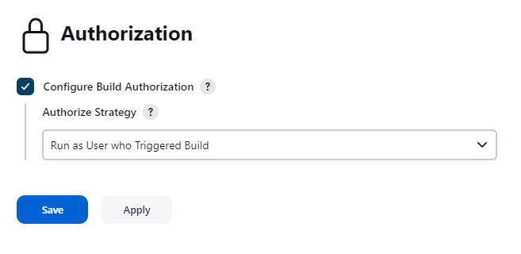
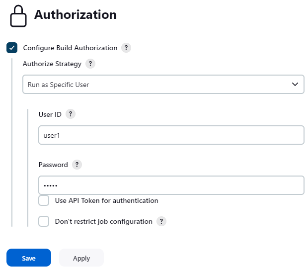
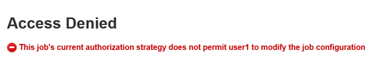

# Authorize Project Plugin for Jenkins

[](https://plugins.jenkins.io/authorize-project)
[](https://plugins.jenkins.io/authorize-project)
[](https://ci.jenkins.io/job/Plugins/job/authorize-project-plugin/job/master/)
[](https://github.com/jenkinsci/authorize-project-plugin/releases)
[](LICENSE)

Configure projects to run builds with specified authorization using [QueueItemAuthenticator](https://javadoc.jenkins.io/jenkins/security/QueueItemAuthenticator.html).

## Features

### Authorization Strategies

| Strategy | Description |
|----------|-------------|
| **Run as the user who triggered the build** | Does not work for scheduled or polled builds. Only users with BUILD permission can configure projects. |
| **Run as anonymous** | Runs the build with no permissions. |
| **Run as a specific user** | Requires password/API token of the target user, unless you are an administrator or specifying yourself. |
| **Run as SYSTEM** | Provided only to override the global configuration. Plugins may treat SYSTEM as anonymous. |

### Access Control

When "Run as Specific User" is selected:

- Administrators can specify any user without authentication.
- Non-admin users specifying a different user must provide credentials (password or API token).
- Only administrators and the configured user can modify the project configuration, unless "Don't restrict job configuration" is enabled.

## Configuration

### Global Security

Add "Configure Build Authorizations in Project Configuration" under **Manage Jenkins > Security > Access Control for Builds**. You can also disable specific strategies from this page.



### Project Authorization

A new **Authorization** menu appears in project sidebars, where you select the authorization strategy for that project.

| | |
|---|---|
|  |  |

When using "Run as Specific User", you can authenticate via password or API token (useful for non-password-based security realms).



Unauthorized configuration attempts are blocked:



## Extension Point

Add custom authorization strategies by extending [`AuthorizeProjectStrategy`](https://javadoc.jenkins.io/plugin/authorize-project/org/jenkinsci/plugins/authorizeproject/AuthorizeProjectStrategy.html):

```java
public abstract Authentication authenticate(
    hudson.model.AbstractProject<?, ?> project,
    hudson.model.Queue.Item item
);
```

Use `AuthorizeProjectStrategyDescriptor` for your `Descriptor`. For global configuration properties, provide a `global-security.jelly` and override `AuthorizeProjectStrategyDescriptor#configureFromGlobalSecurity`.

## Issues

Report bugs and request features via [GitHub Issues](https://github.com/jenkinsci/authorize-project-plugin/issues).

## Contributing

See [CONTRIBUTING.md](CONTRIBUTING.md).

## Changelog

See [GitHub Releases](https://github.com/jenkinsci/authorize-project-plugin/releases) for recent changes and the [Changelog Archive](https://github.com/jenkinsci/authorize-project-plugin/blob/authorize-project-1.6.0/docs/CHANGELOG.old.md) for version 1.3.0 and older.
